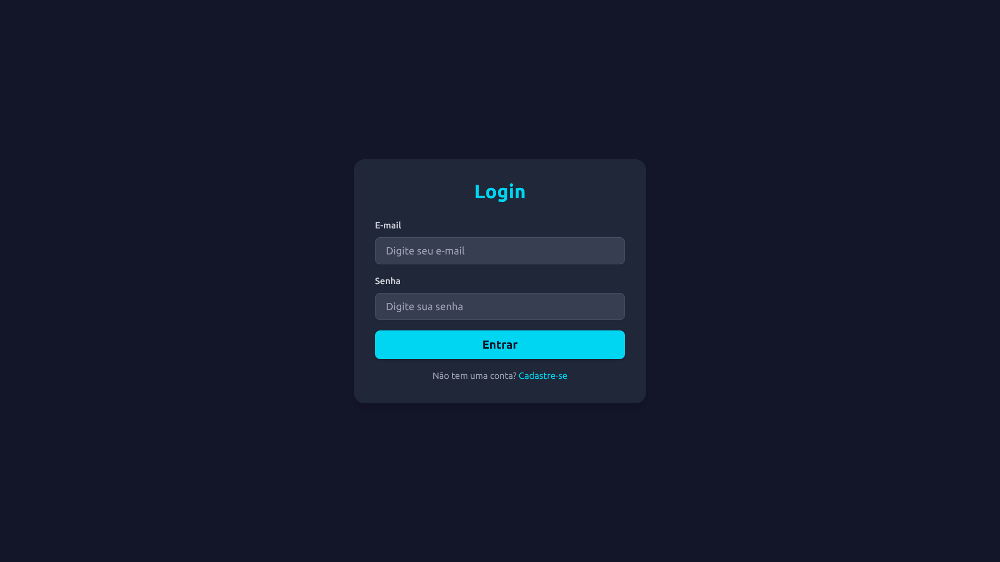

# 🚀 Projeto Login Page

Este projeto é um desafio técnico que implementa uma tela de login/cadastro e um perfil de usuário, utilizando uma arquitetura moderna com frontend em Vue.js e backend em Node.js, ambos conteinerizados com Docker.



## 🛠️ Tecnologias Utilizadas

### Frontend
*   **Vue.js 3 (Composition API):** Framework progressivo para construção de interfaces de usuário.
*   **Vite:** Ferramenta de build rápida para desenvolvimento frontend.
*   **Pinia:** Gerenciamento de estado para Vue.js.
*   **Vue Router:** Roteamento para aplicações Vue.js.
*   **Axios:** Cliente HTTP para fazer requisições à API.
*   **Tailwind CSS:** Framework CSS utilitário para estilização rápida e responsiva.

### Backend
*   **Node.js:** Ambiente de execução JavaScript.
*   **Express.js:** Framework web para Node.js.
*   **Sequelize:** ORM (Object-Relational Mapper) para Node.js, interagindo com o banco de dados MySQL.
*   **MySQL:** Banco de dados relacional.
*   **bcrypt:** Biblioteca para hash de senhas.
*   **jsonwebtoken (JWT):** Para autenticação baseada em tokens.
*   **Joi:** Para validação de esquemas de dados.
*   **dotenv:** Para carregar variáveis de ambiente.

### Infraestrutura
*   **Docker & Docker Compose:** Para conteinerização e orquestração dos serviços (frontend, backend, banco de dados).

### Ferramentas de Apoio (IA)
*   **ChatGPT:** Utilizado para brainstorming, refatoração de código e sugestões de melhores práticas.
*   **Gemini:** Crucial para depuração, resolução de problemas complexos de configuração (como Docker e PostCSS/Tailwind) e revisão geral do projeto.

## ✨ Funcionalidades

*   **Registro de Usuário:** Criação de novas contas com nome, e-mail e senha.
*   **Login de Usuário:** Autenticação de usuários existentes.
*   **Autenticação JWT:** Geração e validação de tokens JWT para acesso seguro.
*   **Perfil do Usuário:** Visualização de informações do usuário autenticado.
*   **Proteção de Rotas:** Rotas protegidas no frontend e backend que exigem autenticação.
*   **Validação de Dados:** Validação de entrada de dados no backend (Joi) e feedback de erro no frontend.
*   **Tratamento de Erros:** Mensagens de erro amigáveis exibidas na interface do usuário.

## 🚀 Como Rodar o Projeto

Para iniciar o projeto completo (frontend, backend e banco de dados), você precisará ter o Docker e Docker Compose instalados em sua máquina.

1.  **Clone o repositório:**
    ```bash
    git clone git@github.com:vitorGaia/login-page.git
    cd login-page
    ```

2.  **Configurar Variáveis de Ambiente:**
    *   Crie um arquivo `.env` dentro da pasta `backend/`.
    *   Adicione as seguintes variáveis (exemplo):
        ```
        APP_PORT=3001
        DB_HOST=db
        DB_USER=root
        DB_PASS=root
        DB_NAME=login_page_db
        DB_PORT=3306
        JWT_SECRET=seu_segredo_jwt_aqui
        BCRYPT_SALT_ROUNDS=10
        ```
    *   Crie um arquivo `.env` dentro da pasta `frontend/`.
    *   Adicione a seguinte variável (exemplo):
        ```
        VITE_API_URL=http://localhost:3001/api
        ```

3.  **Iniciar os Serviços com Docker Compose:**
    A partir da raiz do projeto, execute o seguinte comando:
    ```bash
    docker-compose up --build
    ```
    Este comando irá construir as imagens Docker (se necessário), criar os contêineres e iniciar todos os serviços (banco de dados, backend e frontend).

4.  **Acessar a Aplicação:**
    *   **Frontend:** Abra seu navegador e acesse `http://localhost:5173`.
    *   **Backend API:** A API estará disponível em `http://localhost:3001/api`.

## 📂 Estrutura do Projeto

```
.
├── backend/
│   ├── src/
│   │   ├── app.js
│   │   ├── server.js
│   │   ├── config/
│   │   ├── controllers/
│   │   ├── database/
│   │   ├── middlewares/
│   │   ├── models/
│   │   ├── repositories/
│   │   ├── routes/
│   │   └── services/
│   ├── Dockerfile
│   ├── .env
│   ├── package.json
│   └── ...
├── frontend/
│   ├── public/
│   ├── src/
│   │   ├── assets/
│   │   ├── components/
│   │   ├── router/
│   │   ├── services/
│   │   ├── store/
│   │   └── views/
│   ├── Dockerfile
│   ├── .env
│   ├── package.json
│   └── ...
├── docker-compose.yaml
├── package.json (root)
└── README.md
```

## 💡 Próximos Passos e Melhorias Potenciais

*   **Testes:** 🧪 Implementar testes unitários e de integração para o frontend e backend.
*   **UI/UX:** ✨ Aprimorar a interface do usuário com mais feedback visual (loaders, estados de sucesso/erro mais elaborados).
*   **Funcionalidades:** ➕ Implementar "Esqueceu a senha?", verificação de e-mail, etc.
